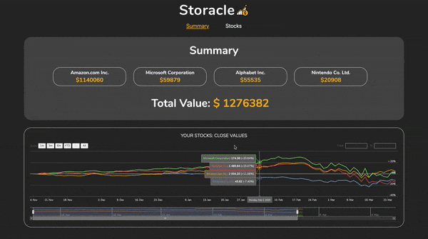

# Storacle

Storacle is a web-app which allows users to track and view their investments in any company.

## Setup

```
cd client
npm install
npm run serve
```
Navigate back to root folder

```
cd server
npm install
npm run server:dev
```

## Demo



### Technologies

Vue.js | JavaScript, Node.js, MongoDB, StockCharts

### Features

- Ability to search and fetch real-time data from the Alpha Vantage Stock API

- User can add/edit stocks and receive an accurate total shares value based on real closing values for the chosen company

- Dynamic rendering of a StockChart for each added stock, and a summary multi-plot StockChart of all stocks

- User can see the total value of all their investments

